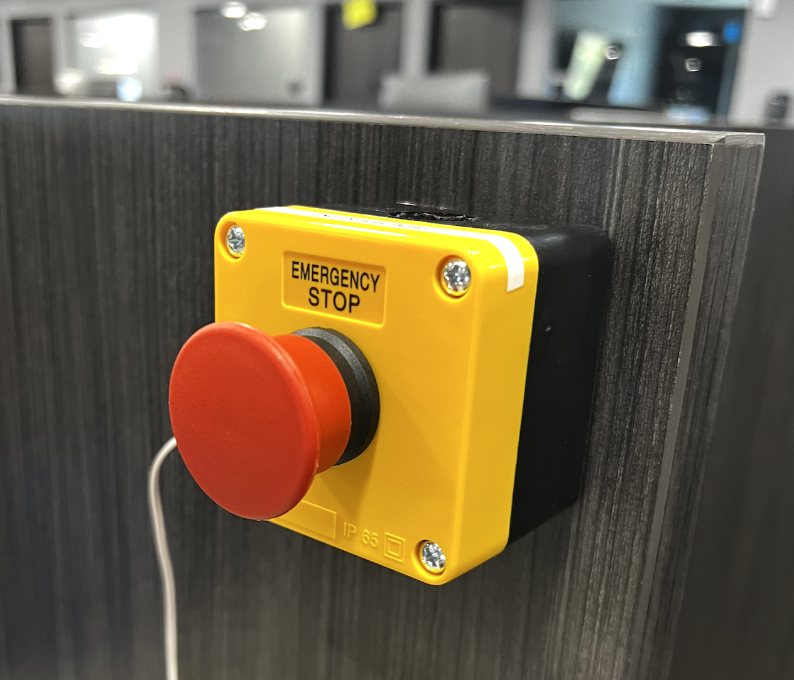

# Big Red Button

Simple program to prevent my coworker Alex from sending Slack messages while I'm away from my desk

## Features
- Locks Windows when the big red button is pressed on the way out of my cubicle
- Detects open circuit when wire is cut and automatically locks Windows every second
- LED status indicator

## Setup
1. Configure app
    - `CONFIG_BUTTON_PIN`: desired pin
    - `CONFIG_BUTTON_PULL`: desired pull direction (`INPUT_PULLUP` for NC, `INPUT_PULLDOWN`, `INPUT`)
    - `CONFIG_BUTTON_PUSH_DIR`: logic level when pushed (HIGH for NC)
    - `CONFIG_BUTTON_REPEAT_MS`: open circuit repeat interval (0 to disable)
2. Wire the button contacts to the Teensy. One leg to the input pin, one to ground.
3. Profit.